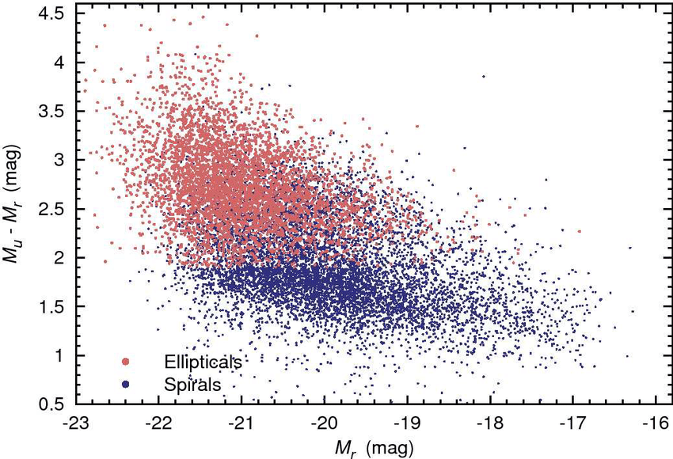

# Galaxy Classifier
This is a basic Machine Learning project, designed as a first-time introduction to the field. The goal of the project is to build a model capable of classifying galaxies into two distinct morphological categories: **Elliptical and Spiral**.

## Dataset
Originally, the project aimed to use a single dataset containing both physical measurements and morphological labels. Since I wasn't able to find any appropriate dataset, I decided to merge two different datasets. Both datasets are available in the repository. The features used in the project are:
* **'ra', 'dec'**: These coordinates are used to represent the celestial location of a galaxy. Their abbreviations come from Right Ascension and Declination. They are crucial as they serve as unique identifiers to cross-match the entries.
* **'p_el', 'p_cs**: These features are the probability of a galaxy being elliptical and spiral.
* **'spiral', 'elliptical'**: These are the binary labels used for Supervised Learning, indicating the final classification of each galaxy.
* **'u', 'g', 'r', 'i', 'z'**: These features correspond to the SDSS Photometric filter system. In astrophysics, the wavelength of electromagnetic radiation defines the light's properties. These filters measure light across different bands (from Ultraviolet to Near-Infrared). These features are used to determine the a galaxy's age and star formation rate, calculating *'Color Indices'* (u-g, g-r ...).

## Data Processing
To train the model it's essential to clean, select and adapt the data. In this project several changes were needed in the datasets:
* **Column Names:** The 'ra' and 'dec' columns were written differently: one as upper case and the other as lower case. Hence, both were changed to upper case.
* **Types:** The raw data for RA and DEC was in sexagesimal format (HH:MM:SS) in one of the datasets. To solve these into degrees, some converting functions were needed.
    * In the RA column it is crucial to know that 1 hour is equivalen to 15 degrees.
    * In the DEC column, in contrast, the main formula is: sign* (|d|+m/60+s/3600)
* **Merge:** After rounding the two identifiers into 4 decimals, I succesfully merged both of the datasets and obtain more than *3000* galaxies.
* **Data Cleaning:** To ensure more quality training, I filtered out all the "Uncertain" classifications, so that only elliptical and spiral remain. Moreover, I removed the columns I wasn't interested in from the datasets.

## Feature Engineering & Preprocessing
The next step is to transform the raw data into features for our model. Some tasks may be completed in these steps:
* **Color Indices:** Computed specific color ratios (u−g,g−r,r−i) to help the model distinguish between stellar populations.This information is important because spirals are younger and brighter, so they emit a lot of u and g and their color is blue; meanwhile ellipticals emit more r and i and the color is red, as they are older and colder. The result are stored in new columns.
* **Features and Labels Division:** Decide which columns are "Features" (X) and which are "Labels" (Y). This is to say, the inputs and the outputs we are waiting.
* **Train and test sets:**: We have to split the data into two subsets. The training set is used to train the model. In contrast, the test set is used to know the accuracy of the model once it has been trained with the training set.
* **Scaling:** Normalizing the data is necessary to ensure that the model doesn't biasedly favor features with larger numerical magnitudes.

## Algorithm
I implemented the K-Nearest Neighbors (KNN) algorithm. KNN is a supervised learning method that classifies a data point based on the majority vote of its neighbors in the multi-dimensional feature space.

## Packages
To carry out this project some packages were essential:
* *Pandas*: This python package is a commonly used in data science and artificial intelligence developing, as it provides high-performance, easy-to-use data structures. Pandas have two main data structures: Series (1 dimension), DataFrames (2 dimension). This last datastructure will be constantly used in this project.
* *sklearn*: This python library provides simple and efficient tools for data analysis and modeling, is commonly used in Machine Learning.
    * train_test_split: Used to divide the dataset train and test sets (in this case in proportions of 80/20).

    * StandardScaler: Used for normalizing features.

    * KNeighborsClassifier (KNN): KNN

    * confusion_matrix: Used to know the model accuracy by evaluating the succeses and failures commited in the test set. 
